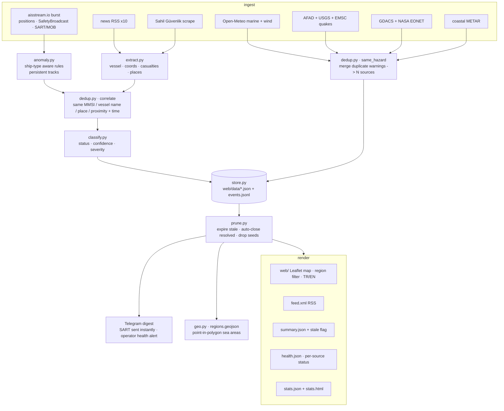

# Architecture

## One cycle



## State that must survive a fresh checkout

CI checks the repo out clean on every run, so three runtime files are **committed
on purpose** (see `.gitignore`):

| File | Without it |
| :-- | :-- |
| `data/sent.json` | every alert re-sends every cycle (the channel spams) |
| `data/vessels.json` | AIS tracks never accumulate, so speed-drop / ais-gap / course-spike can never fire |
| `data/events.jsonl` | the stats page is always empty |

All three are bounded: vessels age out after `ais.vessel_ttl_hours`, sent keys are
capped, and the event log is trimmed to the most recent lines each cycle.

## Key decisions

| Choice | Why |
| :-- | :-- |
| JSON files + `events.jsonl`, no DB | zero-ops; the map is a static site; long history lives in the event log, stats read from it |
| Burst AIS capture, not a daemon | fits a scheduled (cron) or looped worker; ~90 s per cycle |
| Rules, not ML, for anomalies | explainable, testable, no training data; ship-type context removes most false positives |
| Polygon sea areas | precise "which sea area" without a GIS dependency (ray casting, ~15 hand-simplified polygons) |
| Warning `same_hazard` merge | one storm reported by MGM + Open-Meteo + GDACS is one item, "3 kaynak doğruluyor", not three messages |
| Incident `correlate` on entities | one real event (news x8 + AIS track + official statement) becomes one rich incident |
| Every source `_safe`-wrapped | one dead endpoint never stops a cycle; its state shows in `health.json` |
| Digest by default | 15-min cadence -> one combined message per cycle; SART bypasses it |

## Modules

```
src/
  config.py            config.yaml + .env
  geo.py               regions.geojson point-in-polygon
  model.py             Incident / Warning (+ TYPE_TR/STATUS_TR for users)
  store.py             JSON store + same_hazard warning merge + events.jsonl
  ingest/
    _net.py            shared fetch (+ charset sniff, sample fallback)
    ais_stream.py      aisstream burst: PositionReport, ShipStaticData, SafetyBroadcast
    official.py        Sahil Güvenlik scrape  (MGM/AFAD kept, disabled: no stable endpoint)
    openmeteo.py quakes.py gdacs.py eonet.py metar.py navwarn.py reliefweb.py news.py
  process/
    anomaly.py         nav-status / speed-drop / course-spike / ais-gap / ais-sart
    shiptype.py        AIS type code -> category -> anomaly tuning
    extract.py         Turkish text -> vessel / coords / casualties / places
    dedup.py           correlate() incidents ; same_hazard() warnings
    classify.py        status / confidence / severity ; nearest_port
    prune.py           TTL expiry + auto-resolve + seed drop
  render/
    feed.py mapdata.py health.py stats.py
  alert/telegram.py    plain-Turkish messages, digest, sendLocation, operator alerts
  sdr/                 optional DSC / NAVTEX / Whisper (off by default)
web/                   static map + stats page + regions.geojson
eval/                  labels.json + run_eval.py -> REPORT.md
run.py                 orchestrator
```
