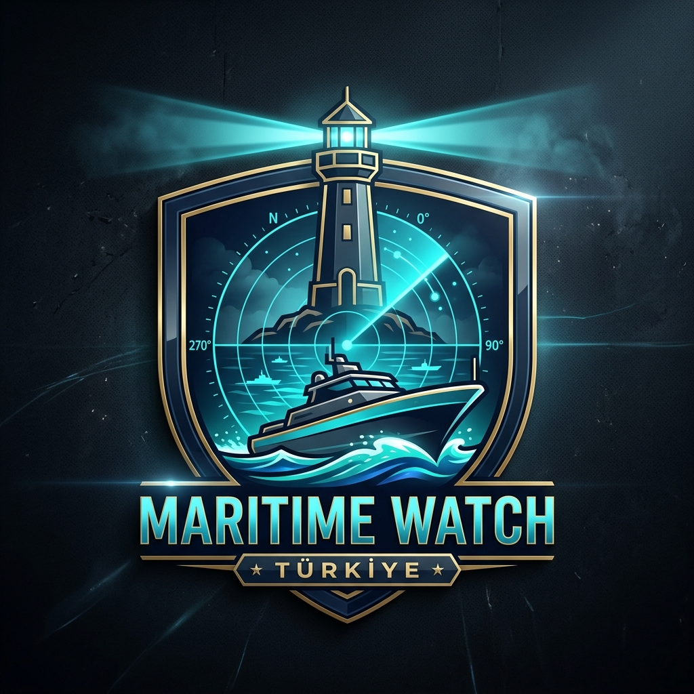
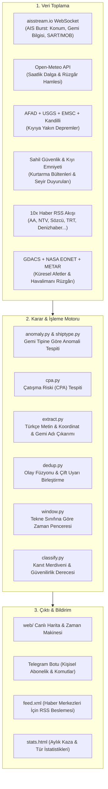

<a id="readme-top"></a>

<div align="center">



# 🌊 Maritime Watch Türkiye

### *Küçük tekne sahibine her sabah "bugün çıkabilir miyim, saat kaça kadar" cevabını veren açık kaynaklı deniz emniyet ve istihbarat sistemi.*

Saatlik deniz hava tahminini **tekne boyuna göre** değerlendirip zaman penceresine çevirir; üstüne canlı AIS anomalilerini, çatışma risklerini (CPA), deniz suyu sıcaklığını, yüzey akıntısını, Sahil Güvenlik bültenlerini, depremleri ve meteorolojik alarmları ekleyip haritada, Telegram'da ve RSS beslemesinde yayınlar.

[](https://keremkalyoncu.github.io/maritime-watch)
[](https://keremkalyoncu.github.io/maritime-watch/stats.html)
[](#-telegram-botu-cebinizdeki-deniz-sentineli)
[](https://keremkalyoncu.github.io/maritime-watch/data/feed.xml)
[](LICENSE)

[](tests/)
[](https://www.python.org/)
[-purple?style=flat-square&logo=android)](https://termux.dev/)
[](https://github.com/astral-sh/ruff)
[-success?style=flat-square)](#-dağıtım-ve-çalıştırma)
[](web/)

</div>

> [!WARNING]
> **BU SİSTEM BİR RESMİ KURTARMA SERVİSİ DEĞİLDİR.**  
> Denizde hayati bir tehlike durumunda derhal **158** (Sahil Güvenlik), **151** (Kıyı Emniyeti) veya **VHF Kanal 16** (156.800 MHz) acil imdat kanalını kullanınız.  
> Bu sistem kamuya açık ve yasal verileri tek bir yerde toplayan **durumsal farkındalık ve önleme** aracıdır.

---

## 📑 İçindekiler

1. [Proje Nedir ve Hangi Sorunu Çözer?](#proje-nedir)
2. [Hedef Kitle: Kime Ne Sağlar?](#hedef-kitle)
3. [Telegram Botu: Cebinizdeki Deniz Sentinel'i](#telegram-botu)
4. [Canlı Web Haritası Özellikleri](#canli-harita)
5. [Sistem Mimarisi ve Veri Akışı](#mimari)
6. [Canlı Veri Kaynakları](#veri-kaynaklari)
7. [Sahada Öğrenilenler & Güvenilirlik](#sahada-ogrenilenler)
8. [Hukuki Tasarım (TCK 132 & KVKK)](#hukuki-tasarim)
9. [Hızlı Başlangıç & Yerel Kurulum](#hizli-baslangic)
10. [Dağıtım ve Çalıştırma](#dagitim)
11. [Depo Dosya Yapısı](#depo-yapisi)
12. [Lisans & Katkı](#lisans)

---

<a id="proje-nedir"></a>

## 💡 Proje Nedir ve Hangi Sorunu Çözer?

Denize küçük tekneyle çıkan bir balıkçı veya amatör denizci sabah uyandığında tek bir soru sorar:  
👉 **"Bugün denize çıkabilir miyim, saat kaça kadar dönebilirim?"**

Mevcut kaynaklar (MGM, MeteoUyarı, Windy vb.) genel hava verisi verir: *"Rüzgâr 20-25 knot, dalga 1.5 metre."* Fakat bu bilgi saatsizdir ve **tekne boyutunu hesaba katmaz**:
* **8 metrelik küçük bir tekne** için 22 knot rüzgâr ve 1.25 m dalga limanda kalma sebebidir; denize çıkarsa alabora riski yaşar.
* **Büyük bir ticari kargo gemisi** için aynı 22 knot rüzgâr hiçbir risk teşkil etmez.

**Maritime Watch**, saatlik deniz tahminlerini alır, kullanıcının tekne sınıfına göre süzer ve şu net sonuca çevirir:
> 🟢 **Marmara Denizi:** 08:00 – 16:00 arası hava uygun (3-4 Bofor).  
> 🟡 **Dikkat:** 16:00 – 19:00 arası rüzgâr 20 knot'a yükseliyor.  
> 🔴 **Çıkmayın:** 19:00'dan sonra fırtına (6 Bofor / 26 knot hamle).

Ayrıca Türkiye karasularındaki tüm kamuya açık olayları (AIS sinyal kayıpları, çatışma riskleri, Sahil Güvenlik arama-kurtarmaları, deniz depremleri ve haberler) 7/24 tarayarak tek bir kontrol panelinde toplar.

---

<a id="hedef-kitle"></a>

## 🎯 Hedef Kitle: Kime Ne Sağlar?

| Kullanıcı | Sağlanan Fayda | Kullanılan Araç |
| :--- | :--- | :--- |
| 🎣 **Küçük Tekne & Balıkçı** | Her sabah 06:00'da kendi denizine ve tekne boyuna özel saatlik çıkış penceresi mesajı. Fırtına dindiğinde *"UYARI KALKTI"* bildirimi. | Telegram Botu (`/bolge`, `/tekne`) |
| ⛵ **Amatör Denizci & Yatçı** | Seyir halinde tek tıkla en yakın liman, mesafe ve anlık dalga/rüzgâr analizi. Acil durumda VHF 16 imdat şablonu. | Telegram Botu (`/neredeyim`, `/mayday`) |
| 📰 **Gazeteci & Kıyı Muhabiri** | Doğrulanmış kaza ve kurtarma operasyonları. Kaynak şeffaflığı ve kanıt merdiveni (`signal` → `probable` → `confirmed`). | Canlı Harita & RSS (`feed.xml`) |
| 🏢 **Liman & Deniz Acentesi** | İstanbul ve Çanakkale Boğazları canlı transit gemi sayısı, sis/görüş kısıtları ve çatışma riski (CPA) erken uyarıları. | Canlı Harita & Bot (`/bogaz`) |
| 🧭 **Kıyı Sakini & Vatandaş** | Denize yakın depremler, tsunami risk değerlendirmesi, regional meteorolojik alarmlar. | Harita & Telegram |

<p align="right">(<a href="#readme-top">başa dön</a>)</p>

---

<a id="telegram-botu"></a>

## 🤖 Telegram Botu: Cebinizdeki Deniz Sentinel'i

Bot, her denizcinin kendi bölgesine ve tekne sınıfına göre özelleştirilmiş bildirim almasını sağlar. Kanala spam atmaz; herkese sadece ilgilendiği denizin bilgisini verir.

```text
       ┌────────────────────────────────────────────────────────┐
       │             MARITIME WATCH TELEGRAM BOTU               │
       ├────────────────────────────────────────────────────────┤
       │ ⚓ /neredeyim      -> Canlı GPS ile en yakın liman & hava│
       │ 🆘 /mayday         -> VHF 16 hazır acil durum anonsu   │
       │ 🚢 /bogaz          -> Boğazlar canlı gemi & sis raporu │
       │ 🎣 /balikci [bölge]-> Sefer emniyeti güvenlik analizi  │
       │ 🚨 /kazalar        -> Güncel kaza & kurtarma bülteni   │
       │ 🌊 /durum          -> Seçili denizlerin anlık havası   │
       │ ⚙️ /bolge & /tekne -> Kişisel deniz ve tekne ayarları  │
       └────────────────────────────────────────────────────────┘
```

### 📋 Bot Komutları ve Kullanımı

#### 1. Seyir ve Emniyet Komutları

* **`/neredeyim` — Anlık Konum & En Yakın Liman:**  
  Telegram'dan canlı konumunuzu (GPS pin) paylaştığınızda; bulunduğunuz deniz bölgesini, en yakın güvenli limanı, limana olan deniz mili mesafesini ve o koordinattaki anlık rüzgâr/dalga durumunu raporlar.
* **`/mayday` — VHF Kanal 16 Telsiz İmdat Şablonu:**  
  Panik anında telsiz mandalına basıp ne söyleyeceğini düşünmek zordur. Bot; teknenizin adı, MMSI numarası ve son bilinen koordinatlarınızı alarak uluslararası standartta Türkçe ve İngilizce telsiz konuşma metni üretir:
  > *"MAYDAY, MAYDAY, MAYDAY. Burası tekne [İSİM], Çağrı İşareti [MMSI]. Mevkiimiz 40°58.2'N 028°50.1'E. Su alıyoruz, batma tehlikemiz var. Teknede 3 kişi var. ACİL YARDIM TALEP EDİYORUZ. TAMAM."*
* **`/bogaz` — Türk Boğazları Canlı Durumu:**  
  İstanbul ve Çanakkale Boğazları'ndaki anlık transit gemi sayısını, sis/görüş koşullarını, akıntı durumunu ve Kıyı Emniyeti'nin seyir kısıtlamalarını raporlar.
* **`/balikci [bölge]` — "Bugün Denize Çıkılır mı?" Analizi:**  
  Örnek: `/balikci marmara` veya `/balikci ege`. Seçilen bölge için önümüzdeki 18 saatin dalga ve rüzgâr kırılımlarını inceler; teknenize göre güvenli denize çıkış ve limana dönüş saatlerini listeler.
* **`/kazalar` — Canlı Olay ve Kurtarma Bülteni:**  
  Son 24 saat içinde Sahil Güvenlik ve Kıyı Emniyeti tarafından doğrulanmış arama-kurtarma çalışmalarını, sürüklenen tekneleri ve kazaları listeler.
* **`/durum` — Anlık Hava Özeti:**  
  Takip ettiğiniz tüm denizler için güncel Bofor rüzgâr şiddeti ve dalga yüksekliği tablosu verir.

#### 2. Kişiselleştirme & Ayarlar

* **`/bolge`:** Takip etmek istediğiniz denizleri seçmenizi sağlar (örn: *Yalnızca Marmara* veya *Kuzey Ege + Güney Ege*). Seçmediğiniz denizlerin bildirimleri sizi rahatsız etmez.
* **`/tekne`:** Tekne sınıfınızı belirler:
  * **Sınıf 1 (Küçük):** $\le 8$ metre (Eşikler: 22 kn rüzgâr / 1.25 m dalga)
  * **Sınıf 2 (Orta):** $8 - 15$ metre (Eşikler: 28 kn rüzgâr / 2.0 m dalga)
  * **Sınıf 3 (Büyük):** $> 15$ metre (Eşikler: 34 kn rüzgâr / 2.5 m dalga)
* **`/abone [bölge]`:** Belirli bir bölgenin anlık fırtına veya kaza alarmlarına doğrudan abone olur.
* **`/ayarlar`:** Kayıtlı bölge, tekne tipi ve bildirim durumunuzu görüntüler.
* **`/dur`:** Bildirimleri dondurur.

#### 3. Sabah 06:00 Günlük Zaman Penceresi Mesajı

Her sabah saat 06:00'da aboneye giden otomatik mesaj örneği:

```text
🌅 GÜNLÜK DENİZ HAVA RAPORU (06:00)
Tekne Sınıfı: 8m ve altı

📍 Marmara Denizi:
🟢 08:00 - 15:00 UYGUN (3-4 Bofor, Dalga 0.6m)
🟡 15:00 - 18:00 DİKKAT (5 Bofor, Rüzgâr 21 kn hamle)
🔴 18:00'den sonra ÇIKMAYIN (6 Bofor, Fırtına uyarısı)

💡 Öneri: Limana dönüşünüzü en geç 15:30'a kadar planlayınız.
```

<p align="right">(<a href="#readme-top">başa dön</a>)</p>

---

<a id="canli-harita"></a>

## 🗺️ Canlı Web Haritası Özellikleri

Web arayüzü (`web/`), hiçbir harici JavaScript kütüphane derleme adımı (React, Webpack, npm build vb.) gerektirmeyen saf HTML5/CSS/Vanilla JS ile tasarlanmıştır.

```text
┌────────────────────────────────────────────────────────────────────────┐
│ 🌊 MARITIME WATCH TÜRKİYE               [Zaman Makinesi ▶] [Acil 🆘]    │
├────────────────────────────────────────────────────────────────────────┤
│ 🟢 Boğazlar: Normal Trafik (34 Gemi) · Marmara Güvenlik İndeksi: 82/100 │
├──────────────────────────────────────┬─────────────────────────────────┤
│ [🔍 Arama...] [🚨Doğrulandı] [🌊Hava] │ 📋 ZAMAN ÇİZELGESİ              │
│                                      │                                 │
│         LEAFLET HARİTASI             │ 🔴 Sahil Güvenlik Kurtarma      │
│     + OpenSeaMap Deniz Fenerleri     │    Bodrum açıkları (2 kişi)     │
│     + AIS Anomali & CPA Çatışma      │ 🌊 Fırtına Uyarısı              │
│     + Dalga & Rüzgâr Vektör Örtüsü   │    Kuzey Ege (7 Bofor)          │
│                                      │ 🟡 Sürüklenme Şüphesi           │
│                                      │    Şile açıkları (Kargo gemisi) │
├──────────────────────────────────────┴─────────────────────────────────┤
│ ⏱️ ZAMAN MAKİNESİ: [◀] [ ━━━●━━━━━━━━━ ] [▶ 1x 2x 4x] Canlı             │
└────────────────────────────────────────────────────────────────────────┘
```

1. **⏱️ Zaman Makinesi (Playback Scrubber):**  
   Haritanın altındaki zaman çubuğu ile son 48 saatteki tüm gemi anomalilerini ve kaza hareketlerini 1x, 2x veya 4x hızında harita üzerinde video gibi geri sarıp oynatabilirsiniz.
2. **🆘 Acil Durum & VHF Frekans Rehberi:**  
   Harita üzerindeki acil durum butonuna basıldığında açılan modal rehber:
   * **VHF Kanal 16 (156.800 MHz):** Uluslararası imdat ve çağrı frekansı.
   * **Alo 158:** Sahil Güvenlik 7/24 arama-kurtarma ihbar hattı.
   * **Alo 151:** Kıyı Emniyeti can kurtarma ve tahlisiye hattı.
   * **Türk Radyo:** Bölgesel deniz hava yayını kanalları (İstanbul Ch 67, İzmir Ch 68 vb.) — *Tek tıkla kopyalanabilir.*
3. **💥 Çatışma Riski (CPA - Closest Point of Approach):**  
   Boğazlar veya dar geçitlerde rotaları ve hızları birbirine tehlikeli derecede yaklaşan gemileri gerçek zamanlı tespit eder ve haritada çatışma riski halkasıyla vurgular.
4. **📊 Canlı Boğaz & Güvenlik Şeridi (`safety-strip`):**  
   Sayfa başında anlık olarak Türk Boğazları'ndan geçen gemi sayısını ve bölgelerin genel deniz güvenlik puanını (0–100) gösterir.
5. **📱 PWA & Çevrimdışı Çalışma (Offline Mode):**  
   Service Worker (`sw.js`) sayesinde deniz ortasında internetiniz kopsa dahi uygulama açılır, son indirilen harita verisini ve acil durum rehberini çevrimdışı olarak ekranınıza getirir.

<p align="right">(<a href="#readme-top">başa dön</a>)</p>

---

<a id="mimari"></a>

## 🏗️ Sistem Mimarisi ve Veri Akışı

Sistem, harici bir SQL veritabanı veya ağır bir sunucu parkı gerektirmeden, **JSON Store + `events.jsonl`** veri mimarisiyle çalışır.



### 🪜 Durum Merdiveni (Status Ladder)

Her olay için yanıltıcı alarm üretmemek adına katı bir kanıt merdiveni uygulanır:

| Kanıt Seviyesi | Status Kodu | Harita Görünümü | RSS Feed | Telegram Bildirimi |
| :--- | :---: | :---: | :---: | :---: |
| Yalnızca AIS Hız/Rota Anomalisi | `signal` | Soluk, kesik çizgili | ✅ | ❌ (Spam engeli) |
| AIS + Haber Eşleşmesi | `probable` | Turuncu | ✅ | ❌ |
| DSC İmdat Çağrısı | `probable` | Turuncu | ✅ | ❌ |
| **Resmi Açıklama (Sahil Güvenlik / KEGM)** | `confirmed` | 🚨 Kırmızı | ✅ | ✅ (Anında gönderilir) |
| Kurtarma Tamamlandı / Tehdit Geçti | `resolved` | 🟢 Yeşil | ✅ | ❌ |

<p align="right">(<a href="#readme-top">başa dön</a>)</p>

---

<a id="veri-kaynaklari"></a>

## 🌐 Canlı Veri Kaynakları

Tüm veri kaynakları `_safe` hata sarıcısıyla korunur; bir kaynak çökse bile döngü asla durmaz.

| Kaynak | Çekilen Veri | API / Yöntem | Durum |
| :--- | :--- | :---: | :---: |
| **aisstream.io** | Gemi konumları, hız düşüşü, rotadan sapma, SART/MOB acil durum vericileri | Ücretsiz WebSocket | 🟢 Canlı |
| **Open-Meteo** | Saatlik dalga yüksekliği, dalga periyodu, 10m rüzgâr hamlesi | Açık REST API | 🟢 Canlı |
| **Sahil Güvenlik** | Resmi arama-kurtarma duyuruları ve tahliye bültenleri | Otomatik Tarama | 🟢 Canlı |
| **Kıyı Emniyeti (KEGM)** | Boğaz geçiş bildirimleri, tahlisiye ve kılavuzluk duyuruları | Otomatik Tarama | 🟢 Canlı |
| **AFAD & Kandilli & USGS & EMSC** | Kıyı depremleri (3 kurum onaylı çifte teyit) | REST / RSS | 🟢 Canlı |
| **Haber RSS (×10)** | AA, Hürriyet, NTV, Sözcü, CNN Türk, TRT, Habertürk, Milliyet, Denizhaber, gCaptain | RSS / XML | 🟢 Canlı |
| **GDACS & NASA EONET** | Fırtına, kasırga, sel ve aşırı doğa olayları | GeoJSON / RSS | 🟢 Canlı |
| **METAR (aviationweather.gov)** | Kıyı havalimanı anlık rüzgâr, fırtına ve görüş kısıtları | Text / METAR | 🟢 Canlı |
| **SDR Modülü (Opsiyonel)** | VHF Ch70 DSC, NAVTEX 518 kHz, VHF 16 ses tarama | RTL-SDR Donanım | ⚪ Opsiyonel |

<p align="right">(<a href="#readme-top">başa dön</a>)</p>

---

<a id="sahada-ogrenilenler"></a>

## 🛡️ Sahada Öğrenilenler & Güvenilirlik

Bu proje masa başında üretilmemiş, **canlı Telegram kanalında yaşanan gerçek tecrübelerle** olgunlaştırılmıştır:

* **"Fixtures Are Not Data" Kuralı:** İlk testlerde Open-Meteo çöktüğünde sistem yedek test verisine (`2.7 m dalga, 41 kn rüzgâr`) düşmüş ve bu sahte fırtına canlı kanala gerçek gibi gitmişti. Artık `_net.py` üretimde sahte veriyi tamamen engeller: *Bir kaynak çökerse sistem susar, asla yalan söylemez.*
* **Sinyal Kesintisi vs. Kayıp Gemi:** Bir döngüde 31 gemi aniden kayboldu uyarısı üretildi; oysa batan gemi yoktu, AIS sağlayıcısı 1 dakikalık bakımdaydı. Artık toplu sinyal kesintileri filtrelenir ve `ais-gap` gemi gerçekten limana yanaşmadıysa birkaç teyit sonrası alarm verir.
* **Gemi Tipine Göre Eşik:** Bir balıkçı teknesinin rölantide beklemesi normal bir balık avıdır. Boğazın ortasında bir tankerin 0 knot'a düşmesi ise acil durumdur. Sistem AIS gemi tip koduna (`shiptype.py`) göre alarm üretir.
* **Hava Eşiği Kalibrasyonu:** İlk sürümde fırtına eşiği 34 knot idi ve kanal haftalarca susmuştu. Oysa 22 knot rüzgâr küçük tekne için ölümcül sınırdı ve Marmara'da 91 saat boyunca bu hava hakimdi. Eşikler tekne sınıfına indirgendi ve sistem doğru zamanda konuşmaya başladı.

---

<a id="hukuki-tasarim"></a>

## ⚖️ Hukuki Tasarım (TCK 132 & KVKK)

Bu proje Türk Ceza Kanunu ve Kişisel Verilerin Korunması Kanunu sınırlarına titizlikle uyar:

1. **TCK 132 (Haberleşmenin Gizliliği):**  
   Telsiz frekanslarını dinlemek serbest olsa da, konuşmaları kaydetmek ve üçüncü kişilere aktarmak suçtur. Bu nedenle Maritime Watch, **kişiler arası sesli telsiz trafiğini asla kaydetmez, deşifre etmez ve yayınlamaz.** Yalnızca açık kamu verileri (AIS, DSC, resmi bültenler) kullanılır.
2. **KVKK ve Kişisel Veri Maskelemesi (`privacy.py`):**  
   Kazalarda hayatını kaybedenlerin veya yaralananların isimleri haber bültenlerinden otomatik olarak temizlenir ve maskelenir. Cenaze ve adli dava detayları deniz emniyeti taşımadığı için elenir.
3. **Abone Gizliliği:**  
   Telegram kullanıcılarının `chat_id` bilgileri yalnızca yerel `data/subscribers.json` içinde saklanır; `.gitignore` ile korunur ve asla GitHub'a veya genel sunuculara aktarılmaz.

<p align="right">(<a href="#readme-top">başa dön</a>)</p>

---

<a id="hizli-baslangic"></a>

## 🚀 Hızlı Başlangıç & Yerel Kurulum

Sistem için harici bir veritabanı veya Docker gerekmez. Yalnızca **Python 3.11+** ve temel kütüphaneler yeterlidir.

### 1. Depoyu Klonlayın ve Bağımlılıkları Yükleyin

```bash
git clone https://github.com/KeremKalyoncu/maritime-watch.git
cd maritime-watch
python -m pip install -r requirements.txt
```

### 2. Canlı Haritayı Yerel Olarak Başlatın (Test Modu)

Herhangi bir API anahtarı olmadan, test verileriyle sistemi hemen ayağa kaldırabilirsiniz:

```bash
python run.py --once --serve
```

Tarayıcınızda açın: **`http://127.0.0.1:8000`**

### 3. Canlı Veri ile Çalıştırma (Ücretsiz & Kartsız)

Canlı AIS ve Telegram bildirimleri için `.env` dosyasını oluşturun:

```bash
cp .env.example .env
```

`.env` dosyanızı düzenleyin:
```ini
# Ücretsiz AIS Anahtarı: https://aisstream.io/apikeys
AISSTREAM_KEY=buraya_anahtari_yazin

# Telegram BotFather'dan alınan bot token'ı
TELEGRAM_BOT_TOKEN=123456789:ABCdefGhIJKlmNoPQRsTUVwxyZ

# Bildirimlerin gideceği kanal veya grup ID'si (örn: @denizkanali veya -100123456789)
TELEGRAM_CHAT_ID=@senin_kanal_adın
```

Canlı döngüyü ve botu başlatın:
```bash
python run.py --loop --send
```

<p align="right">(<a href="#readme-top">başa dön</a>)</p>

---

<a id="dagitim"></a>

## 🚢 Dağıtım ve Çalıştırma

| Dağıtım Yolu | Donanım / Altyapı | Maliyet | Gecikme | Kullanım Amacı |
| :--- | :--- | :---: | :---: | :--- |
| **Eski Akıllı Telefon (Edge Micro-Node)** | **Samsung Galaxy Note 4 (Android / Termux)** | **~$0.10/ay (1.2W)** | **< 1 sn (Gerçek Zamanlı)** | **Mükemmel Ev Sunucusu:** Çekmecede duran eski Android telefonu headless bir Linux micro-server'a dönüştürür; Long Polling ile Telegram botunu 7/24 sıfır gecikmeyle çalıştırır. |
| **GitHub Actions + Pages** | **Bulut Runner (Ubuntu)** | **$0** | ~15 dk | **Sıfır Sunucu Otomasyonu:** Her 15 dakikada bir veri kazıyıcılarını çalıştırır, harita katmanlarını derler ve GitHub Pages'e basar. |
| **Bulut VPS (Hetzner / DigitalOcean)** | **1 vCPU / 1GB RAM VPS** | ~€3.5/ay | Gerçek Zamanlı | Profesyonel kurumsal dağıtım veya yüksek aboneli bot trafiği için. |

### 📱 Eski Telefonu 1.2W Linux Edge Server'a Dönüştürme (Termux)

Bu proje için pahalı bir bulut sunucusu kiralamak yerine, 2014 model bir **Samsung Galaxy Note 4** (Exynos 5433 / 3GB RAM) tam teşekküllü bir Linux sunucuya dönüştürülmüştür:
1. **Termux & Python Ortamı:** F-Droid üzerinden Termux kurulup OpenSSH (`sshd`), Python 3.12, git ve tmux yapılandırıldı.
2. **Uykuda Kesintisiz Çalışma:** `termux-wake-lock` ve pil optimizasyon muafiyeti ile telefon ekranı tamamen kapalıyken CPU derin uykudan korunur.
3. **Long Polling Optimizasyonu:** Telegram botu 1.5 saniyelik agresif HTTP yoklaması yerine **20 saniyelik HTTP Keep-Alive Long Polling** mimarisine geçirildi. Bu sayede saatlik 2.400 TLS bağlantısı ~140'a indirilerek telefonun pil tüketimi -118 mA'dan **-45 mA seviyesine (%62 tasarruf)** çekildi. Masada prizden çektiği toplam güç sadece **1.2 Watt**'tır (2026 EPDK tarifesiyle ayda ~3.5 TL).
4. **Otomatik Başlangıç:** `~/.bashrc` içerisine eklenen tmux servis denetleyicisi ile telefon yeniden başlasa bile bot arka planda ayağa kalkar.

---

<a id="depo-yapisi"></a>

## 📁 Depo Dosya Yapısı

```text
maritime-watch/
├── run.py                 # Ana orkestratör döngüsü (--once / --loop / --serve)
├── config.yaml            # Bölge sınırları, eşikler, anahtar kelimeler ve kaynak ayarları
├── src/
│   ├── alert/
│   │   ├── bot.py         # Kişisel abonelik ve interaktif Telegram botu (/neredeyim, /mayday)
│   │   └── telegram.py    # Kanal bildirimleri, acil durum alarmları ve özet motoru
│   ├── ingest/            # Canlı veri toplayıcıları (AIS, OpenMeteo, Deprem, SG, Haberler)
│   │   ├── _net.py        # Güvenli fetch katmanı (sahte veri sızıntı koruması)
│   │   └── ais_stream.py  # aisstream.io WebSocket burst dinleyicisi
│   ├── process/           # Veri işleme & Yapay Karar Motoru
│   │   ├── anomaly.py     # Gemi-tipi duyarlı kural tabanlı anomali tespiti
│   │   ├── cpa.py         # Çatışma riski (CPA) hesaplama algoritması
│   │   ├── extract.py     # Türkçe NLP koordinat ve kaza metni ayrıştırıcı
│   │   ├── dedup.py       # Çapraz kaynak olay birleştirme ve teyit motoru
│   │   └── window.py      # Tekne boyuna göre saatlik seyir güvenlik penceresi
│   ├── render/            # Web çıktı üreticileri (feed.xml, health.json, straits.json)
│   └── sdr/               # Opsiyonel donanım modülü (Ch70 DSC & NAVTEX rehberi)
├── web/                   # Statik Leaflet haritası, Zaman Makinesi, PWA Service Worker
├── tests/                 # 78+ Çevrimdışı pytest birim testi
└── eval/                  # NLP ve sınıflandırma başarım ölçüm seti
```

---

## 🧪 Test ve Kalite Kontrol

Kod tabanı tam test kapsamına sahiptir ve harici ağa ihtiyaç duymadan çevrimdışı test edilebilir:

```bash
# Tüm birim testlerini çalıştır
python -m pytest

# Kod kalite ve lint kontrolü
python -m ruff check .

# Model ve metin çıkarım başarı testi
python eval/run_eval.py
```

---

<a id="english-summary"></a>

## 🇬🇧 English Overview & Quickstart

**Maritime Watch** is an open-source maritime situational awareness and coastal intelligence system designed for artisanal fishermen, small craft operators, and coastal communities in Turkish waters.

### Key Capabilities
- **Small-Craft Safety Index (0-100):** Translates hourly Open-Meteo marine forecasts (wind gusts, wave heights, sea surface temperature, and surface currents) into tailored "Go / No-Go" departure windows based on vessel length ($\le 8\text{m}$, $8-15\text{m}$, $>15\text{m}$).
- **Real-Time AIS & Collision Risk (CPA):** Ingests live ITU-R M.1371 packets via `aisstream.io` WebSocket, calculating Closest Point of Approach (CPA $< 0.35\text{ NM}$) and Time to CPA (TCPA $\le 12\text{ min}$) for active commercial traffic.
- **Turkish Straits Corridor Telemetry:** Real-time Bosphorus and Dardanelles transit status, active vessel counts, corridor speeds, and METAR visibility/fog restrictions.
- **24/7 Telegram Assistant:** Instant GPS location query (`/neredeyim`), VHF Channel 16 MAYDAY template generation, and straits status.
- **Zero-Cost Edge + Cloud Hybrid Architecture:** Runs the interactive Telegram listener on a recycled Samsung Galaxy Note 4 micro-server (1.2W power draw via Termux/tmux) while heavy scraping and static Leaflet map hosting are handled by GitHub Actions and GitHub Pages.
- **207 Passing Unit Tests & 100% Type-Checked:** Complete offline test suite covering edge scenarios, network drops, and boundary conditions.

---

<a id="lisans"></a>

## 📜 Lisans & Katkı

Bu proje [MIT Lisansı](LICENSE) ile açık kaynak olarak sunulmuştur.  
Topluluk katkılarına, denizcilerden gelecek eşik geri bildirimlerine ve balıkçı kooperatifi deneyimlerine tamamen açıktır.

Katkıda bulunmak için lütfen [CONTRIBUTING.md](CONTRIBUTING.md) belgesini inceleyiniz.

<div align="center">

**Maritime Watch Türkiye**  
*Denizde emniyet, kıyıda şeffaflık.*

</div>
