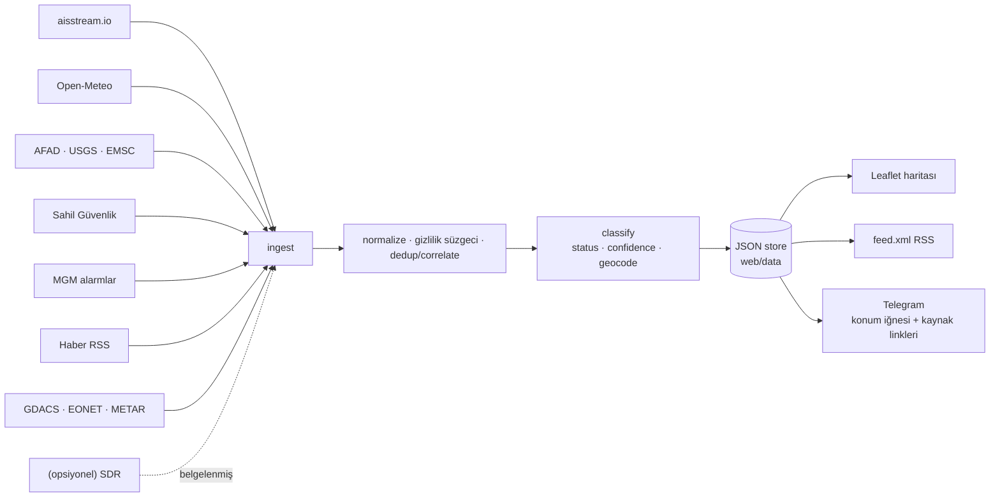

<a id="readme-top"></a>

<div align="center">

# 🌊 Maritime Watch

**Türkiye karasuları için deniz olayı erken-uyarı ve şeffaflık aracı.**

AIS anomalilerini, resmi açıklamaları ve denizcilik hava uyarılarını tek akışta birleştirir;
sonucu bir haritada, bir RSS beslemesinde ve opsiyonel bir Telegram kanalında yayınlar.

[Canlı harita](https://keremkalyoncu.github.io/maritime-watch) &middot;
[İstatistikler](https://keremkalyoncu.github.io/maritime-watch/stats.html) &middot;
[RSS](https://keremkalyoncu.github.io/maritime-watch/data/feed.xml) &middot;
[Mimari](ARCHITECTURE.md) &middot;
[Hata bildir](https://github.com/KeremKalyoncu/maritime-watch/issues)

[![tests][tests-shield]][tests-url]
[![veri döngüsü][update-shield]][update-url]
[![python][python-shield]][python-url]
[![lisans][license-shield]][license-url]
[![son commit][commit-shield]][commit-url]

</div>

> [!WARNING]
> Bu bir kurtarma servisi **değildir**. Acil durumda **158** (Sahil Güvenlik) veya **112**.
> Araç yalnızca kamuya açık ve resmi bilgiyi hızlı, tek yerde toplar.

<details>
  <summary><b>İçindekiler</b></summary>

1. [Proje hakkında](#proje-hakkında)
   - [Kime ne sağlar](#kime-ne-sağlar)
   - [Neyi sağlamaz](#neyi-sağlamaz)
2. [Nasıl çalışır](#nasıl-çalışır)
   - [Akış](#akış)
   - [Durum merdiveni](#durum-merdiveni)
3. [Veri kaynakları](#veri-kaynakları)
4. [Sahada öğrenilenler](#sahada-öğrenilenler)
5. [Hızlı başlangıç](#hızlı-başlangıç)
   - [Canlı veri](#canlı-veri-hepsi-ücretsiz-kartsız)
   - [Komutlar](#komutlar)
6. [Dağıtım](#dağıtım)
7. [Hukuki tasarım](#hukuki-tasarım)
8. [Depo yapısı](#depo-yapısı)
9. [Test ve ölçüm](#test-ve-ölçüm)
10. [Yol haritası](#yol-haritası)
11. [Katkı](#katkı)
12. [Lisans](#lisans)

</details>

---

## Proje hakkında

Türkiye'de bir deniz kazası olduğunda bilgi dağınıktır: Sahil Güvenlik bir duyuru yayınlar,
MGM ayrı bir fırtına uyarısı verir, haber siteleri birbirinden kopyalar, AIS verisi ise
kimsenin bakmadığı bir yerde durur. Bunların hepsi **kamuya açık**. Maritime Watch bunları
15 dakikada bir toplar, aynı olayın farklı anlatımlarını tek kayda indirger, kaynak
göstererek yayınlar.

Sunucu gerektirmez: GitHub Actions cron + GitHub Pages ile **sıfır maliyetle** çalışır.

### Kime ne sağlar

| Kullanıcı | Aldığı şey |
| :-- | :-- |
| 🎣 **Balıkçı / küçük tekne** | Opt-in Telegram kanalı — *"Yarın Marmara'da 7–8 Bofor lodos, fırtına uyarısı"*. Resmi uyarı, sade Türkçe. Fırtına geçince **"UYARI KALKTI"** mesajı da gelir. |
| 📰 **Gazeteci / araştırmacı** | Web haritası + zaman çizelgesi. Her kayıtta kaynak linki ve **doğrulanmadı** etiketi. |
| 🏢 **Haber merkezi** | `feed.xml` (RSS) — olay akışını kendi sistemine bağlar. |
| 🧭 **Vatandaş** | Bölge filtresi, TR/EN arayüz, aylara ve türe göre istatistik. |

### Neyi sağlamaz

- Kurtarma yapmaz — o Sahil Güvenlik'in işidir.
- **AIS'i olmayan tekneleri göremez.** Göçmen botlarının çoğu, küçük balıkçı tekneleri
  ve kapalı transponderli gemiler bu araca görünmez. Bu, aracın en büyük kör noktası.
- "İlk duyan biz" garantisi vermez. Gecikme = cron aralığı (~15 dk).

<p align="right">(<a href="#readme-top">başa dön</a>)</p>

---

## Nasıl çalışır

- **Poligon deniz bölgeleri** — bbox değil, 15 poligonla point-in-polygon: "İstanbul Boğazı",
  "Güney Ege", "Mersin–İskenderun Körfezi" gibi kesin bölge adı. GIS bağımlılığı yok.
- **Gemi-tipi farkında anomali** — balıkçı teknesinin durması normaldir, boğazda bir tankerin
  durması kritiktir. AIS tip kodundan ayırt eder.
- **AIS-SART / MOB / EPIRB** — imdat vericisinin MMSI ön eki tek başına alarmdır (970/972/974),
  digest kuyruğunu atlar, anında gider.
- **Olay birleştirme** — aynı gerçek olayın 8 haber + AIS izi + resmi açıklama hâli tek zengin
  kayda iner. Eşleştirme sırası: MMSI → gemi adı → konum/zaman yakınlığı.
- **Uyarı birleştirme** — aynı depremi veren AFAD + USGS + EMSC tek kayıt olur ve mesaj
  *"3 bağımsız kaynak doğruluyor"* der.
- **Türkçe metin çıkarma** — haber ve resmi metinden gemi adı, koordinat (DMS + ondalık),
  kişi sayısı, olay türü. Türkçe İ/I büyük-küçük harf tuzağı dahil.
- **Kendi kendini onarma** — çıkarıcı geliştikçe eski kayıtlar her döngüde yeniden ayrıştırılır;
  "operasyon tamamlandı" diyen resmi kaynak olayı kapatır; bayat uyarı süresi dolunca silinir.
- **Sağlık takibi** — `health.json` kaynak başına canlı/örnek/down durumunu tutar; 3+ kaynak
  düşerse operatöre uyarı gider, harita "veri X saat eski" bandı gösterir.

### Akış



### Durum merdiveni

Çıktıyı bu tablo yönetir. Bir olay ancak resmi kaynak doğruladığında Telegram'a düşer.

| Kanıt | status | Haritada | Feed | Telegram |
| :-- | :-- | :-- | :--: | :--: |
| Yalnız AIS anomalisi | `signal` | soluk, kesik çizgili | ✅ | ❌ |
| AIS + haber | `probable` | turuncu | ✅ | ❌ |
| DSC distress | `probable` | turuncu | ✅ | ❌ |
| **Resmi açıklama** | `confirmed` | kırmızı | ✅ | ✅ |
| Sonuç geldi | `resolved` / `false-positive` | yeşil / gri | ✅ | ❌ |

Önleme kanalı ayrı hattır: girdi zaten resmi olduğu için (MGM, NAVTEX) doğrudan iletilir.

<p align="right">(<a href="#readme-top">başa dön</a>)</p>

---

## Veri kaynakları

| Kaynak | Ne getirir | Anahtar | Durum |
| :-- | :-- | :--: | :-- |
| **aisstream.io** | Gemi konumu, AIS anomalisi, SART/MOB, güvenlik yayını (msg 14) | ücretsiz | 🟢 canlı |
| **Open-Meteo** marine + forecast | Dalga yüksekliği ve rüzgâr hamlesi tahmini | — | 🟢 canlı |
| **AFAD · USGS · EMSC** | Kıyıya yakın depremler, üç kurum çapraz doğrulamalı | — | 🟢 canlı |
| **Sahil Güvenlik** | Resmi kurtarma açıklamaları | — | 🟢 canlı (scrape) |
| **MGM** `/web/alarmlar` | Resmi meteorolojik alarmlar, denizciliğe göre süzülmüş | — | 🟢 canlı |
| **Haber RSS** ×10 | AA, Hürriyet, NTV, Sözcü, CNN Türk, TRT, Habertürk, Milliyet, Denizhaber, gCaptain | — | 🟢 canlı |
| **GDACS** | Bölgesel afet uyarıları (fırtına, sel, kasırga) | — | 🟢 canlı |
| **NASA EONET** | Doğa olayları | — | 🟢 canlı |
| **aviationweather.gov** METAR | Kıyı havaalanı rüzgâr / görüş / fırtına | — | 🟢 canlı |
| MGM deniz tahmini | — | — | 🔴 endpoint 404 (Eyl 2026), Open-Meteo kapsıyor |
| NGA NAVAREA III | Seyir uyarıları | — | 🔴 endpoint 404, kod hazır |
| ReliefWeb | Türkiye afet raporları | — | 🔴 API v1 kapandı (410), kod hazır |
| AFAD basın açıklamaları | — | — | 🔴 sayfa 404, deprem verisi yukarıdan geliyor |
| **SDR** (DSC / NAVTEX / Ch16) | Yapısal tehlike, MSI, ses | — | ⚪ opsiyonel modül, varsayılan kapalı |

> [!NOTE]
> Ölü kaynaklar `config.yaml`'de gerekçesiyle birlikte kapalı tutuluyor, kodları silinmiyor —
> endpoint geri gelirse tek satırla açılır.

<p align="right">(<a href="#readme-top">başa dön</a>)</p>

---

## Sahada öğrenilenler

Bu bölüm projeyi demo olmaktan çıkaran kısım. Hepsi **canlı kanalda gerçekten olan**
hatalar ve karşılığında konan korumalar.

| Ne oldu | Koruma |
| :-- | :-- |
| Open-Meteo düştü, test fixture'ındaki `2,7 m / 41 kn` **gerçek tahmin diye kanala gitti** | `_net.py` tek kapı: prodüksiyonda fixture'a düşmek kapalı. Ölü kaynak boş döner — yanlış konuşmaktansa susar. 11 kaynağın hepsi için regresyon testi var. |
| Bir döngüde **31 "gemi kayboldu"** uyarısı — hepsi aynı dakikada susmuştu | Kaybolan gemiler değil, AIS beslemesi düşmüştü. Aynı sessizliği paylaşan filo artık bastırılıyor. |
| Sıradan 60°'lik dönüş **44 sahte alarm** üretti | `course-spike` varsayılan kapalı; açıkken bile yalnız gerçek rota tersine dönüşü + uygun gemi tipi. |
| Ölen kişilerin ve yakınlarının **adları kanala ve git geçmişine** düştü | Cenaze/tutuklama/duruşma haberleri kaynakta eleniyor; kalanlarda kişi adı maskeleniyor. Gemi adları korunuyor — Türkçede gemi adları insan adına benzer. |
| Aynı duyuru **her gün yeni olay** olarak haritaya düştü | Kimlikler tarihten değil içerikten türetiliyor. `hash()` süreç başına tuzlandığı için sha1'e geçildi. |
| `TUÄBERK Ä°MAMOÄLU` — bozuk kodlanmış başlıklar hem okunmuyor hem dedup'ı bozuyordu | Yanlış çözümlenmiş UTF-8 hem fetch'te hem depoda onarılıyor. |
| Fırtına geçti, uyarı **18 saat asılı kaldı** | Tahmin canlı dönüp bölgeyi artık listelemiyorsa "UYARI KALKTI" mesajı gidiyor. Ölü kaynak asla "her şey yolunda" sayılmaz. |
| 55 km içerideki deprem *"kıyıya yakın deprem"* diye duyuruldu | Kara/deniz maskesi olmadığı için artık tahmin yürütülmüyor: yalnız bölge adı ve en yakın limanın mesafesi yazılıyor. |
| Cron atlayınca durum kayboluyordu | Gemi izleri, gönderilmiş mesajlar ve olay günlüğü depoya yazılıyor; `vessels.json` gemi başına tek satır, sıralı ve kısaltılmış koordinatla — git delta'ları çalışsın diye. |

<p align="right">(<a href="#readme-top">başa dön</a>)</p>

---

## Hızlı başlangıç

Gereken: Python 3.11+ ve beş paket. Derleme adımı, veritabanı, Docker yok.

```bash
git clone https://github.com/KeremKalyoncu/maritime-watch.git
cd maritime-watch
py -m pip install -r requirements.txt     # Linux/macOS: python3

py run.py --once --serve                  # bir döngü + http://127.0.0.1:8000
```

Anahtarsız çalışır: AIS katmanı ve uyarılar `src/ingest/samples/` içindeki örnek veriyle
gelir, Telegram mesajları konsola ve `data/outbox.log`'a yazılır — gönderilmez.

### Canlı veri (hepsi ücretsiz, kartsız)

```bash
cp .env.example .env
```

| Değişken | Nereden | Not |
| :-- | :-- | :-- |
| `AISSTREAM_KEY` | <https://aisstream.io/apikeys> | Yalnız e-posta ister |
| `TELEGRAM_BOT_TOKEN` | Telegram'da `@BotFather` → `/newbot` | |
| `TELEGRAM_CHAT_ID` | Kanal ID'si | Bot **kanalda yönetici** olmalı, yoksa `400: chat not found` |

```bash
py run.py --loop --send
```

### Komutlar

| Komut | Ne yapar |
| :-- | :-- |
| `py run.py --once` | Tek döngü (dry-run), çık |
| `py run.py --loop` | `config.yaml → loop.interval_seconds` aralığıyla sürekli |
| `py run.py --serve` | Sadece `web/` klasörünü sun |
| `py run.py --once --send` | Telegram'a **gerçekten** gönder |
| `py run.py --no-ais` / `--no-scrape` | Katman kapat |
| `py run.py --config yol.yaml` | Başka bir yapılandırma |
| `py -m pytest` | 131 test |
| `py eval/run_eval.py` | Precision / recall raporu |

<p align="right">(<a href="#readme-top">başa dön</a>)</p>

---

## Dağıtım

| Yol | Maliyet | Gecikme | Not |
| :-- | :--: | :-- | :-- |
| **GitHub Actions + Pages** — `.github/workflows/update.yml` | **$0** | ~15 dk | Sunucu yok. Public repo = sınırsız Actions dakikası. Secrets: `AISSTREAM_KEY`, `TELEGRAM_BOT_TOKEN`, `TELEGRAM_CHAT_ID` |
| Fly.io / Koyeb free | $0 | ~gerçek zamanlı | Küçük always-on; WebSocket'i açık tutar |
| Ucuz VPS (Hetzner ~€4/ay) | düşük | gerçek zamanlı | `py run.py --loop --send` + systemd; SDR modülleri de buraya |

> [!TIP]
> GitHub cron'u garantili değildir — pratikte 1–5 saatlik atlamalar görülüyor. Bu yüzden
> tüm durum depoya commit edilir ve her koşu taze checkout'ta kaldığı yerden devam eder.

Harita statiktir; `web/` klasörünü herhangi bir statik host (Pages, Vercel, Netlify,
Cloudflare Pages) yayınlar.

<p align="right">(<a href="#readme-top">başa dön</a>)</p>

---

## Hukuki tasarım

Araç **TCK 132** (haberleşmenin gizliliği) ve **KVKK** gözetilerek tasarlandı.

- ✅ **Yayına giden akış yalnızca resmi ve açık kaynaklıdır** — resmi açıklamalar, MGM/NAVTEX
  uyarıları ve alım için yayınlanan açık veri (AIS, DSC güvenlik yayını). Bunları toplamak ve
  dağıtmak serbesttir.
- ❌ **Kişiler arası telsiz trafiği kaydedilmez, dökümü çıkarılmaz, yayınlanmaz.**
- ⚙️ `src/sdr/` modülü **opsiyonel, deneysel ve varsayılan kapalıdır.** Kuralları: yalnız alıcı
  (RX-only), yalnız izinli frekanslar (Ch16, DSC, NAVTEX, amatör afet, havacılık acil —
  **asla** kolluk/askerî), kalıcı kayıt yok, ham yakalama asla yayınlanmaz.
  Ayrıntı: [`src/sdr/README.md`](src/sdr/README.md).
- 🔒 **Kişisel veri:** kaza kurbanlarının ve yakınlarının adları yayına çıkmaz. Cenaze,
  tutuklama ve duruşma haberleri denizciye bir şey söylemediği için kaynakta elenir; kalan
  metinde kişi adı maskelenir. Bu süzgeç depoda duran eski kayıtlara da her döngüde uygulanır.

Habercilik açısından: haber değeri taşıyan olguyu (bir kurtarma yaşandığını) doğrulanmış ve
kaynak göstererek duyurmak korunur; ham telsiz trafiğini dağıtmak değil.

<p align="right">(<a href="#readme-top">başa dön</a>)</p>

---

## Depo yapısı

```text
run.py                    orkestratör (--once / --loop / --serve)
config.yaml               bölge, eşikler, anahtar kelimeler, aralıklar
src/
  config.py               config.yaml + .env
  model.py                Incident / Warning (CAP-benzeri) + kararlı id + kodlama onarımı
  store.py                web/data/*.json + events.jsonl
  geo.py                  poligon deniz bölgeleri (point-in-polygon)
  ingest/
    ais_stream.py         aisstream.io burst capture
    official.py           Sahil Güvenlik + MGM alarmları (savunmacı scrape)
    openmeteo.py quakes.py news.py gdacs.py eonet.py metar.py navwarn.py reliefweb.py
    _net.py               ortak fetch — "fixture asla yayına çıkmaz" kuralının tek kapısı
    samples/              çevrimdışı test önbelleği (TEST FIXTURE, veri değil)
  process/
    anomaly.py            kural tabanlı AIS anomali + SART/MOB + besleme kesintisi koruması
    dedup.py              olay korelasyonu + same_hazard (çift uyarı birleştirme)
    classify.py           status / confidence / severity / geocode / en yakın liman
    extract.py            Türkçe metinden gemi adı, koordinat, kişi sayısı, tür
    privacy.py            kişi adı maskeleme + aftermath süzgeci
    prune.py              bayat kayıt temizliği, geriye dönük onarım, "uyarı kalktı"
    shiptype.py           AIS tip kodu → kategori ve duyarlılık profili
  render/                 feed.xml (RSS) + summary.json
  alert/telegram.py       sade Türkçe mesajlar, digest, tekrar koruması
  sdr/                    opsiyonel modül — entegrasyon rehberi + stub
web/                      Leaflet haritası + stats.html (statik, build yok)
tests/                    pytest (131)
eval/                     precision/recall ölçümü
.github/workflows/        tests.yml + update.yml
```

<p align="right">(<a href="#readme-top">başa dön</a>)</p>

---

## Test ve ölçüm

```bash
py -m pytest          # 131 test
py -m ruff check .    # lint
py eval/run_eval.py   # eval/REPORT.md üretir
```

Testler CI'da Python 3.11 / 3.12 / 3.13 üzerinde koşar. Test yapılandırması gerçek
`config.yaml`'i okur — elle kopyalanmış bir fixture, prodüksiyonda kapalı olan kaynakları
ve ölü ayarları gizlediği için kaldırıldı.

Güncel ölçüm: [`eval/REPORT.md`](eval/REPORT.md). Sayılar sentetik ve küçük örneklem
üzerinden; mutlak başarı iddiası değil, **regresyon takibi** içindir.

<p align="right">(<a href="#readme-top">başa dön</a>)</p>

---

## Yol haritası

Açık maddeler: [`TODO.md`](TODO.md). Öne çıkanlar:

- [ ] NAVAREA III için çalışan bir endpoint bulmak
- [ ] MGM `/api/meteoalarm` erişimi (şu an 403)
- [ ] Kıyı çizgisi maskesi — deprem merkez üssünün karada mı denizde mi olduğunu söyleyebilmek
- [ ] Daha geniş eval kümesi, gerçek olay arşiviyle

## Katkı

[`CONTRIBUTING.md`](CONTRIBUTING.md). Kullanılan ve atıf yapılan açık kaynak projeler:
[`NOTICE`](NOTICE).

Kaynak eklerken tek kural: fetch **`src/ingest/_net.py`** üzerinden geçmeli, ve kaynak
düştüğünde boş dönmeli. Yanlış konuşmaktansa susmak.

## Lisans

MIT — [`LICENSE`](LICENSE).

<p align="right">(<a href="#readme-top">başa dön</a>)</p>

[tests-shield]: https://img.shields.io/github/actions/workflow/status/KeremKalyoncu/maritime-watch/tests.yml?branch=main&label=tests&style=for-the-badge
[tests-url]: https://github.com/KeremKalyoncu/maritime-watch/actions/workflows/tests.yml
[update-shield]: https://img.shields.io/github/actions/workflow/status/KeremKalyoncu/maritime-watch/update.yml?branch=main&label=veri%20d%C3%B6ng%C3%BCs%C3%BC&style=for-the-badge
[update-url]: https://github.com/KeremKalyoncu/maritime-watch/actions/workflows/update.yml
[python-shield]: https://img.shields.io/badge/python-3.11%20%7C%203.12%20%7C%203.13-3776AB?style=for-the-badge&logo=python&logoColor=white
[python-url]: https://www.python.org/
[license-shield]: https://img.shields.io/github/license/KeremKalyoncu/maritime-watch?style=for-the-badge
[license-url]: https://github.com/KeremKalyoncu/maritime-watch/blob/main/LICENSE
[commit-shield]: https://img.shields.io/github/last-commit/KeremKalyoncu/maritime-watch?style=for-the-badge
[commit-url]: https://github.com/KeremKalyoncu/maritime-watch/commits/main
