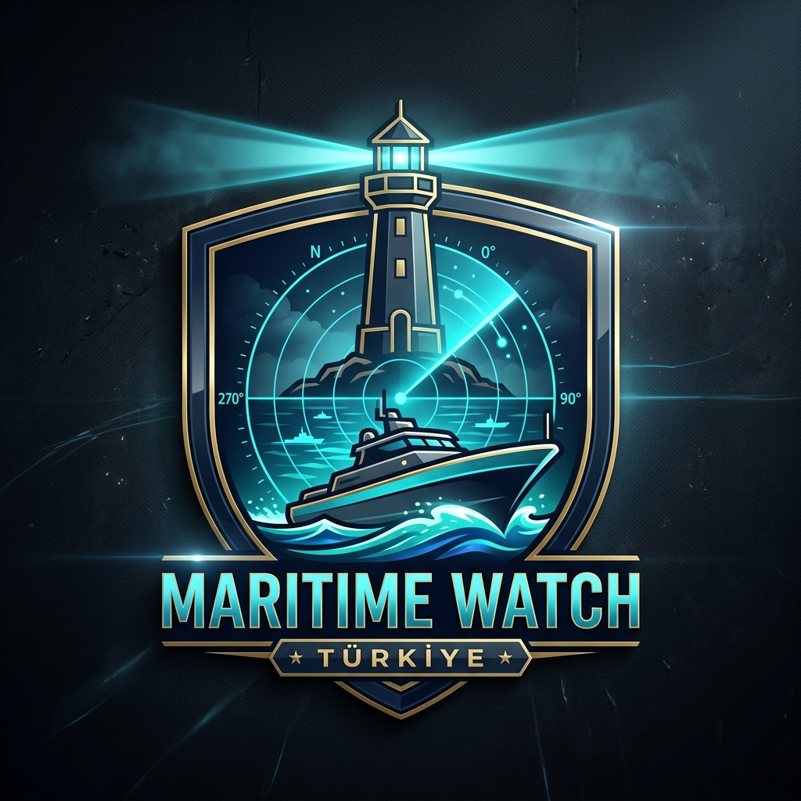
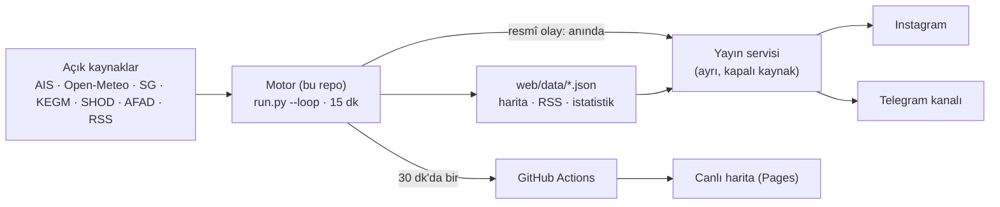

<a id="readme-top"></a>

<div align="center">



# Maritime Watch Türkiye

**Küçük tekneyle denize çıkacak birine her sabah tek bir soruyu cevaplar:**
**bugün çıkılır mı, çıkılırsa saat kaça kadar?**

[](https://keremkalyoncu.github.io/maritime-watch)
[](https://www.instagram.com/denizecikilirmi/)
[](https://t.me/Marmara_Deniz_Uyari)
[](https://keremkalyoncu.github.io/maritime-watch/data/feed.xml)
[](LICENSE)

[Türkçe](#readme-top) · [English](#english-summary)

</div>

> [!WARNING]
> **Bu sistem resmî bir uyarı ya da kurtarma servisi değildir.** Karar her zaman teknedekinindir.
> Denizde tehlikede: **158** Sahil Güvenlik · **151** Kıyı Emniyeti · **VHF Kanal 16** (156.800 MHz).

---

## Nereden takip edilir

| Nerede | Ne gelir |
| :--- | :--- |
| **Instagram** [@denizecikilirmi](https://www.instagram.com/denizecikilirmi/) | Her sabah 06:00 kaydırmalı bülten (13 bölge, bölge bölge saatlik şerit) ve hikâye. 18:00'de "Yarın sabah çıkılır mı?" hikâyesi. |
| **Telegram kanalı** [@Marmara_Deniz_Uyari](https://t.me/Marmara_Deniz_Uyari) | Aynı sabah bülteni, öğlen boğaz duyuruları, akşam "yarın sabah" kartı ve resmî kaynaklı olay uyarıları geldiği anda. |
| **[Canlı harita](https://keremkalyoncu.github.io/maritime-watch)** | AIS gemileri, olaylar, uyarılar, rüzgâr ve dalga katmanı, "bugün çıkılır mı" paneli, son 48 saati geri saran zaman çubuğu. |
| **[RSS](https://keremkalyoncu.github.io/maritime-watch/data/feed.xml)** · **[İstatistik](https://keremkalyoncu.github.io/maritime-watch/stats.html)** | Olay akışı ve aylık özet. |

Telegram botu herkese açık değildir; uyarıların tek kanalı yukarıdaki Telegram kanalıdır. Yanlış gördüğünüz bir şeyi Instagram'dan mesajla ya da GitHub'da issue açarak bildirebilirsiniz.

---

## Hangi sorunu çözer

Rüzgâr ve dalga tahmini her yerde var: *"Rüzgâr 20-25 knot, dalga 1.5 metre."* Ama bu sayı tekne boyunu hesaba katmaz. 22 knot hamle bir gemi için sıradan bir gündür, 7 metrelik açık bir balıkçı teknesi için alabora sebebidir.

Maritime Watch saatlik tahmini **8 metre ve altı tekneye** göre okur ve 13 deniz bölgesinin her biri için tek bir karar yazar:

| Etiket | Anlamı |
| :--- | :--- |
| **ELVERİŞLİ** | Gün ışığı boyunca sınırların altında. |
| **TEDBİRLİ** | Sınıra yakın (sınırın %75'i) ya da dik dalga, sis gibi bir tehlike var. |
| **15:00 ÖNCESİ UYGUN** | Sabah uygun, gün içinde bozuyor: o saatten önce limanda olun. |
| **UYGUN DEĞİL** | Hamle 22 knotu ya da dalga 1.25 metreyi geçiyor (ya da geçmesi bekleniyor). |
| **VERİ YOK** | Kaynak cevap vermedi. Asla "sakin" yazılmaz. |

Karar; bölgenin güvenlik puanı, küçük tekne sınırları ve gün içindeki saatlik pencerelerden **en kötüsüdür**. Her kararın yanında gerekçesi yazar: *"15:00 sonrası hamle 26 kn bekleniyor"* gibi.

Bölgeler: Marmara Denizi, İzmit Körfezi, İstanbul Boğazı, Çanakkale Boğazı, Saroz Körfezi, Kuzey Ege, Güney Ege, Antalya Körfezi, Mersin Körfezi, İskenderun Körfezi, Batı, Orta ve Doğu Karadeniz.

### Karar motorunun kuralları

- **Dik dalga:** Periyot 4.5 saniyenin altında ve dalga 0.7 metre ve üstündeyse küçük teknede kırıcı çırpıntı sayılır, sınırlar %30 sıkılaşır (`marine_physics.py`, `window.py`).
- **Sis:** Görüş 300 metrenin altına düşünce rüzgâra bakılmadan "uygun değil" (`window.py`).
- **Gün ışığı:** Pencereler gün batımında biter; limana dönüş saati gün batımından önceye çekilir (`astronomy.py`).
- **Boğazlarda orkoz:** Güneyli rüzgâr üst akıntıya karşı eserse tedbirli geçiş uyarısı.
- **Rüzgâr adları:** Yön, denizcinin kullandığı adlarla yazılır (Poyraz, Lodos, Karayel…).

---

## Veri kaynakları

Tamamı herkese açık. Her kaynak kendi hata sarmalayıcısında çalışır: biri çökerse döngü durmaz, o kaynağın verisi "yok" olarak kalır.

| Kaynak | Ne alınır |
| :--- | :--- |
| [aisstream.io](https://aisstream.io) | AIS gemi konumları, hız ve rota anomalileri, SART/MOB vericileri |
| [Open-Meteo](https://open-meteo.com) | Saatlik rüzgâr, hamle, dalga yüksekliği ve periyodu (CC BY 4.0) |
| Sahil Güvenlik · Kıyı Emniyeti | Resmî arama-kurtarma ve operasyon duyuruları |
| SHOD NAVTEX · MGM | Seyir uyarıları, meteorolojik alarmlar |
| AFAD · Kandilli · USGS · EMSC | Kıyıya yakın depremler |
| Haber RSS (10 kaynak) | AA, NTV, TRT Haber, CNN Türk, Denizcilik Dergisi, gCaptain ve diğerleri |
| GDACS · NASA EONET · METAR | Küresel afetler, kıyı havalimanlarında ölçülen rüzgâr ve görüş |

Bilinen sınır: AIS alıcı ağı **İstanbul ve Çanakkale boğazlarının kendisini kapsamıyor**. Bu yüzden boğaz mesajlarında gemi sayısı yazılmaz, "AIS kapsamıyor" yazılır.

---

## Dürüst veri ve sahada öğrenilenler

Bu kurallar, canlı kanalda yapılmış gerçek hatalardan çıktı:

- **Test verisi asla yayınlanmaz.** Bir gün Open-Meteo çöktü ve testler için tutulan örnek veri (dalga 2.7 m, rüzgâr 41 kn) kanala gerçek tahmin gibi gitti. Artık üretimde örnek veriye düşmek kapalı: kaynak çökerse sistem susar (`ingest/_net.py`).
- **Yanlış AIS alarmı.** Rota sıçraması ve sinyal kaybı kuralları gemi tipine göre ayarlandı; yanlış alarmlar bir ölçümde 83'ten 4'e indi (`anomaly.py`, `shiptype.py`).
- **Kurtarılan, kayıp değildir.** "34 kişi kurtarıldı" duyurusu sistemde "kritik acil durum" sanılıp yayınlanmıştı. Artık kurtarılan ve kayıp/yaralı ayrı sayılır; bitmiş bir kurtarma acil durum olarak gitmez (`extract.py`).
- **"0 gemi" yazılmaz.** AIS boğazları görmüyorsa sayı bilinmiyordur, sıfır değildir.
- **VTS kanalları** resmî TSVTS kılavuzuyla karşılaştırılıp düzeltildi.
- **Kaynak sağlığı ölçülür.** Her döngü kaydını tutar; hangi kaynağın ne sıklıkla düştüğü haftada bir raporlanır (`health_history.py`).

---

## Nasıl çalışır


```mermaid
flowchart LR
    SRC["Açık kaynaklar<br/>AIS · Open-Meteo · SG · KEGM · SHOD · AFAD · RSS"] --> ENG["Motor (bu repo)<br/>run.py --loop · 15 dk"]
    ENG --> JSON["web/data/*.json<br/>harita · RSS · istatistik"]
    ENG -- "resmî olay: anında" --> SOC["Yayın servisi<br/>(ayrı, kapalı kaynak)"]
    JSON --> SOC
    SOC --> IG["Instagram"]
    SOC --> TG["Telegram kanalı"]
    ENG -- "30 dk'da bir" --> GH["GitHub Actions"] --> PAGES["Canlı harita (Pages)"]
```

- **Motor** 2014 model bir Samsung Galaxy Note 4'te (Android 6, Termux, Python 3.8) 15 dakikada bir döner, sonuçları telefonun diskine yazar.
- **Yayın servisi** aynı telefonda çalışır; sabah, öğlen ve akşam yayınlarını ve resmî olay uyarılarını Instagram'a ve Telegram kanalına gönderir.
- **Herkese açık harita** GitHub Actions ile güncellenir. GitHub'ın zamanlayıcısı saatlerce gecikebildiği için telefon yarım saatte bir güncellemeyi kendisi tetikler.
- Veritabanı yok: JSON dosyaları ve `data/events.jsonl` olay günlüğü.

Olaylar bir kanıt merdiveninden geçer; yalnız resmî kaynağın doğruladığı olay anında gönderilir:

| Kanıt | Durum | Haritada | Kanala anında |
| :--- | :---: | :---: | :---: |
| Yalnız AIS anomalisi | `signal` | soluk | hayır |
| AIS + haber eşleşmesi, DSC çağrısı | `probable` | turuncu | hayır |
| Sahil Güvenlik / KEGM açıklaması | `confirmed` | kırmızı | evet |
| Bitti / tehdit geçti | `resolved` | yeşil | hayır |

---

## Gizlilik ve hukuk

- **Telsiz sesi kaydedilmez.** Telsizi dinlemek serbest olsa da duyulanı kaydedip yaymak haberleşmenin gizliliğine girer. Proje yalnız herkese açık yayınları (AIS, resmî duyurular, tahminler) kullanır. `src/sdr/` yalnız bir taslaktır, çalışan kod içermez.
- **İsimler maskelenir.** Haberlerdeki kişi adları ve adli ayrıntılar yayından önce temizlenir (`privacy.py`).
- **Takipçi verisi toplanmaz.** Instagram ve Telegram kanalı takipçileri hakkında hiçbir şey tutulmaz. Telegram botu yalnız yöneticiye açıktır; başka birinin chat id'si kaydedilmez.

---

## Kendi bilgisayarında çalıştırma

Python 3.11+ (motor 3.8 ile de uyumlu; CI ikisini de test eder). Veritabanı ya da Docker gerekmez.

```bash
git clone https://github.com/KeremKalyoncu/maritime-watch.git
cd maritime-watch
python -m pip install -r requirements.txt
python run.py --once --serve      # bir döngü çalıştırır, haritayı http://127.0.0.1:8000 adresinde açar
```

Anahtar olmadan da çalışır; AIS dışındaki kaynakların hepsi açık. Canlı AIS için [aisstream.io](https://aisstream.io/apikeys)'dan ücretsiz anahtar alıp `.env` dosyasına yazın:

```bash
cp .env.example .env              # AISSTREAM_KEY=...
python run.py --loop              # 15 dakikada bir döner
```

Testler internet gerektirmez:

```bash
python -m pip install -r requirements-dev.txt
python -m pytest                  # 300+ çevrimdışı test
python -m ruff check .
```

### Eski bir telefonda çalıştırmak (Termux)

```bash
bash ~/maritime-social/scripts/note4_social_run.sh   # önce yayın servisi: uyarı dinleyicisi hazır olsun
bash ~/maritime-watch/scripts/note4_sync.sh          # git güncelle + tmux 'engine' oturumunda motoru başlat
tmux attach -t engine                                # log (çıkış: Ctrl-b d)
```

`note4_sync.sh` güncellerken `data/` ve `web/data/` durumunu korur. `.env` ve abone dosyaları yalnız telefonda kalır. Termux açılınca eksik servisi başlatmak için `~/.bashrc`'ye `bash ~/maritime-watch/scripts/note4_autostart.sh >/dev/null 2>&1` eklenebilir. Ayrıntı: [SECURITY.md](SECURITY.md).

---

## Depo yapısı

```text
maritime-watch/
├── run.py                # döngü: --once / --loop / --serve
├── config.yaml           # bölgeler, eşikler, kaynak ayarları
├── src/
│   ├── ingest/           # kaynaklar (AIS, Open-Meteo, SG, KEGM, SHOD, deprem, RSS…)
│   ├── process/          # anomali, CPA, metin çıkarma, olay birleştirme, pencere, güvenlik puanı
│   ├── render/           # web/data/*.json, feed.xml, istatistik
│   ├── health_history.py # döngü başına kaynak sağlığı
│   ├── pages_dispatch.py # telefondan harita güncelleme isteği
│   └── sdr/              # taslak, kullanılmıyor
├── web/                  # Leaflet haritası (saf HTML/CSS/JS), çevrimdışı çalışan PWA
├── tests/                # çevrimdışı testler
└── eval/                 # metin çıkarma ölçüm seti
```

---

## Sık sorulanlar

**Ücretli mi?** Hayır. Reklam yok, abonelik yok, kod MIT lisanslı.

**Neden 8 metre ve altı?** Hava en çok onları etkiliyor. Sınırlar `config.yaml`'da; orta ve büyük tekne sınıfları da tanımlı.

**Açık denizde internet yoksa?** Harita bir kez açıldıktan sonra son veriyle ve acil durum rehberiyle (VHF 16, 158, 151, kıyı radyosu kanalları) çevrimdışı da açılır.

**Resmî uyarının yerine geçer mi?** **Hayır.** Durumsal farkındalık ve sefer öncesi karar desteği içindir.

---

<a id="english-summary"></a>

## English summary

**Maritime Watch** is an open-source decision aid for small boats on the Turkish coast. Every morning at 06:00 it reads the hourly marine forecast for 13 sea areas against small-craft limits (8 m and under: gusts 22 kn, waves 1.25 m) and publishes one verdict per area — *good*, *caution*, *good before HH:MM*, *no-go*, or *no data* — with the reason and an hour-by-hour strip, on Instagram ([@denizecikilirmi](https://www.instagram.com/denizecikilirmi/)) and a Telegram channel ([@Marmara_Deniz_Uyari](https://t.me/Marmara_Deniz_Uyari)). It also tracks live AIS anomalies and collision risk (CPA), official Coast Guard notices, earthquakes and warnings on a [live map](https://keremkalyoncu.github.io/maritime-watch).

Missing data stays missing: no fixture data is ever published, and no "0 ships" where AIS does not reach. The engine runs 24/7 on a 2014 Galaxy Note 4 (Termux, Python 3.8); GitHub Actions publishes the map. Not an official warning service: in an emergency call 158 or use VHF Channel 16.

---

<a id="ai-disclosure"></a>

## AI Transparency & Disclosure / Yapay Zekâ Beyanı

We believe in full transparency regarding the use of AI tools in open-source software:

* **Production Runtime (0% AI / Zero LLMs):** The live decision and safety engine is **100% deterministic, rule-based Python**. All Closest Point of Approach (CPA) collision mathematics, spatial polygon containment checks, vessel anomaly detection, and small-craft safety index formulas rely strictly on standard geometry, physics, and threshold heuristics. **There are NO Large Language Models (LLMs) or generative AI APIs in the live runtime decision path**, eliminating hallucination risks in marine safety.
* **Development Assistance:** AI coding assistants were utilized during development as pair-programming tools for drafting unit test scenarios, improving type annotations, code refactoring, and English documentation translation.

---

## Lisans ve katkı

[MIT Lisansı](LICENSE). Denizcilerden gelen eşik geri bildirimlerine ve kooperatif deneyimlerine açığız; katkı için [CONTRIBUTING.md](CONTRIBUTING.md). Güvenlik açığı, token sızıntısı ya da sahte emniyet verisi için public issue yerine [SECURITY.md](SECURITY.md).

<div align="center">

*Denizde emniyet, kıyıda şeffaflık.*

</div>
